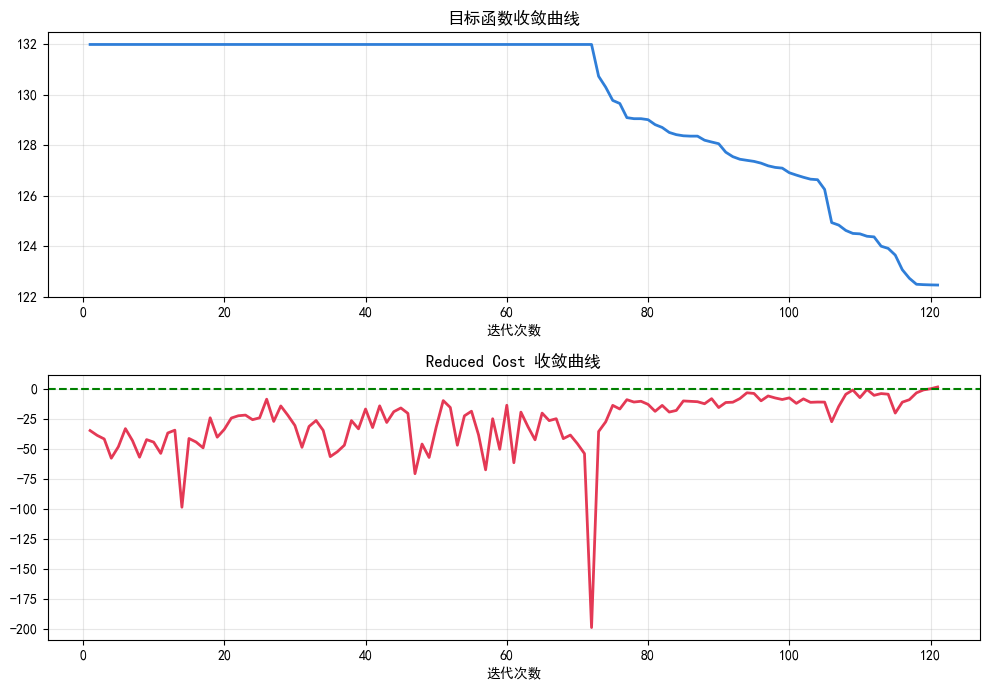
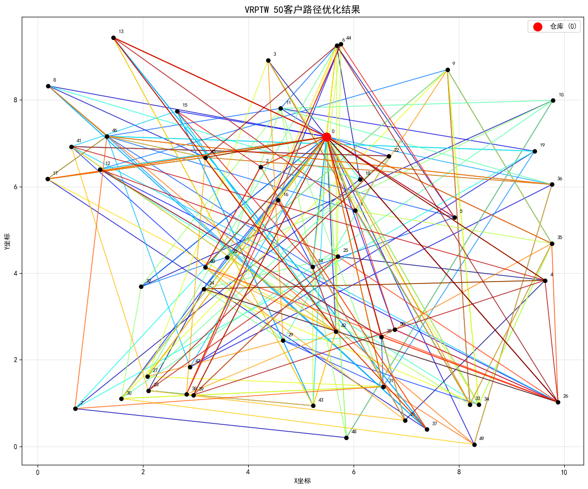

# 带时间窗车辆路径问题列生成求解

## 项目简介
本项目使用**列生成算法**求解带时间窗车辆路径问题（VRPTW），基于丹齐格-沃尔夫分解思想，将大规模组合优化问题拆分为**主问题**与**定价子问题**迭代求解，规避传统整数规划模型变量规模爆炸的缺陷，求解得到线路规划线性松弛最优解，同时完成迭代收敛过程可视化分析。

---

## 问题描述
1. 以单一仓库作为车辆起终点，采用多车协同完成客户配送任务
2. 每台配送车辆存在固定最大载货容量限制
3. 每个客户节点设置专属服务时间窗，仅允许在指定时间区间内开展服务
4. 整体优化目标：最小化所有配送车辆的总行驶里程

---

## 数学模型

### 1. 主问题：路线选择模型
设已生成的所有可行配送路线集合为 $R$

$x_r$：表示路线 $r$ 是否被选用

$c_r$：路线 $r$ 对应的总行驶成本

$a_{ir}$：客户访问标记，客户 $i$ 经过路线 $r$ 则取值为1，否则为0

$C$：全体客户集合

$$
\min \quad \sum_{r\in R} c_r x_r
$$

$$
s.t. \quad \sum_{r\in R} a_{ir} x_r \ge 1,\quad \forall i\in C
$$

$$
x_r \ge 0
$$

约束含义：每一个客户节点有且仅有一条配送路线完成服务，保证所有客户配送需求全覆盖。

---

### 2. 定价子问题：带资源约束的最短路径问题
子问题为每台车构建**带时间窗、容量、时序约束的最短路径问题**，目标是生成**负检验数**路线。

#### 决策变量
$y_{ij}$：车辆是否直接从节点 $i$ 行驶到节点 $j$

$t_i$：车辆到达节点 $i$ 的时间

$q_i$：车辆到达节点 $i$ 时的累计载重

#### 目标函数（最小化检验数）
$$
\min \sum_{i=0}^{n} \sum_{j=0}^{n} c_{ij} y_{ij} - \sum_{i=1}^{n}\sum_{j=1}^{n} \pi_i y_{ij}
$$

#### 约束条件

**1. 流平衡约束**

$$
\sum_{j=0}^{n} y_{ij} = \sum_{j=0}^{n} y_{ji}, \quad \forall i
$$

**2. 访问次数约束**

$$
\sum_{j=0}^{n} y_{ij} \le 1, \quad \forall i=1,2,...,n
$$

**3. 时间窗约束**

$$
t_i + s_i + d_{ij} \le t_j, \quad \forall (i,j) \in A \\
a_i \le t_i \le b_i, \quad \forall i
$$

**4. 容量约束**

$$
\sum_{i\in C} q_i\left(\sum_{j} y_{ij}\right) \le Q
$$

**5. 变量定义域**

$$
y_{ij} \in \{0,1\}, \quad t_i \ge 0, \quad q_i \ge 0
$$

---

### 3. 检验数计算公式
求解主问题线性松弛模型后，得到每个客户对应的对偶变量$\pi_i$。
任意一条新生成可行路线$r$的检验数计算公式：

$$
rc_r = c_r - \sum_{i\in r}\pi_i
$$

- 当 $rc_r < 0$：该路线具备优化空间，加入主问题
- 当 $rc_r \ge 0$：无优化空间，算法收敛

---

## 算法整体流程
1. 采用贪心插入启发式生成初始可行路线
2. 求解主问题，提取对偶变量
3. 代入子问题，搜索负检验数路线
4. 将新路线加入主问题，重复迭代
5. 无负检验数路线时，停止迭代并输出最优解

---

## 运行结果展示

### 1. 算法收敛曲线


- 上方目标函数曲线：前70轮保持初始值，随着有效列持续加入，总行驶里程逐步下降，最终收敛至最优值 122.46
- 下方检验数曲线：迭代过程中呈曲折波动，整体向0靠近，最终收敛至非负区间，完全符合列生成算法收敛特征
- 迭代后期曲线趋于平稳，证明算法已求得线性松弛最优解

---

### 2. 最终车辆调度方案


- 红色标识为配送中心仓库节点，其余黑色点位为需求客户节点
- 不同颜色线条分别代表每一台配送车辆的完整行驶路径
- 迭代后期曲线趋于平稳，证明算法已求得线性松弛最优解
- 所有路线均严格满足车辆载重上限与客户服务时间窗约束，路径规划合理

## 文件结构
├── vrptw_cg.py # 列生成算法完整核心代码

├── 参考算例.xlsx # 节点属性信息、时间旅行矩阵

└── README.md # 项目整体说明文档

## 运行环境依赖
执行以下命令安装所需第三方库
```bash
pip install gurobipy pandas numpy matplotlib openpyxl


