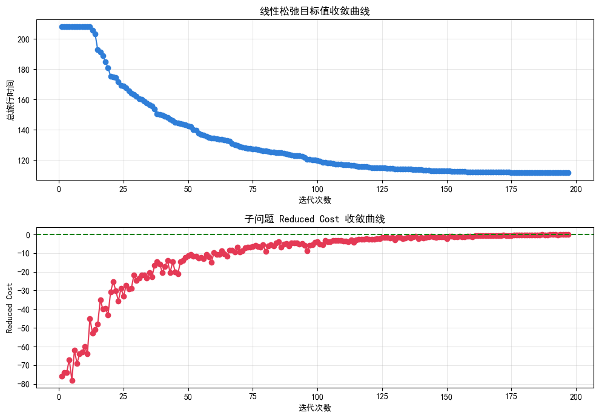
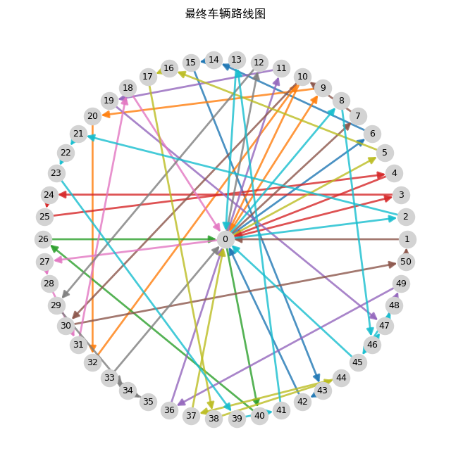

# VRPTW 列生成求解器

基于 **Dantzig-Wolfe 分解** 与 **精确标签算法 (ESPPRC)** 的带时间窗车辆路径问题求解器。  
使用 Python + Gurobi 实现，可处理 50 个客户的算例，目标是**最小化总旅行时间**，自动确定最优车辆数。

---

## 问题描述
- 节点 0 为仓库，1…n 为客户  
- 每客户有服务时间、需求量和硬时间窗（允许早到等待，不允许迟到）  
- 车辆容量固定，车辆数不限  
- 寻找覆盖所有客户且总旅行时间最小的路径集合

---

## 数学模型

### 主问题（Set Partitioning 线性松弛）

**集合**  
- $N = \{1, 2, \dots, n\}$：客户集合  
- $\Omega$：所有可行路径的集合（列生成过程中动态扩充）

**参数**  
- $c_r$：路径 $r \in \Omega$ 的总旅行时间（距离成本）  
- $a_{ir} \in \{0,1\}$：路径 $r$ 是否服务客户 $i$

**变量**  
- $\lambda_r \geq 0$：路径 $r$ 被选用的权重（列生成阶段松弛为连续变量）

**模型**

$$
\begin{aligned}
\min \quad & \sum_{r \in \Omega} c_r \lambda_r \\
\text{s.t.} \quad & \sum_{r \in \Omega} a_{ir} \lambda_r ≥ 1, \quad \forall i \in N \\
& \lambda_r \ge 0, \quad \forall r \in \Omega
\end{aligned}
$$

**对偶变量**  
记约束 $\sum_{r} a_{ir}\lambda_r ≥ 1$ 的对偶变量为 $\pi_i$，用于子问题中计算 reduced cost。

---

### 子问题（定价问题，ESPPRC）

**目标**：寻找一条满足容量和时间窗约束的可行路径，使其 **reduced cost** 最小。

对于一条路径 $p = (0, i_1, i_2, \dots, i_k, 0)$，其 reduced cost 定义为：

$$
\bar{c}_p = \sum_{(u,v) \in p} d_{uv} - \sum_{v \in p \setminus \{0\}} \pi_v
$$

其中 $d_{uv}$ 为节点 $u$ 到 $v$ 的旅行时间，$\pi_v$ 为客户 $v$ 对应的对偶变量。

**状态空间（标签）**  
一个标签 $L$ 代表一条从仓库到当前节点的局部路径，包含：
- $cost$：累积 reduced cost
- $time$：离开当前节点的时间（服务完成后）
- $load$：累积载重
- $visited$：已访问客户集合（用位掩码表示）
- $node$：当前所在节点

**初始状态**  
$L_0 = (0, 0, 0, \emptyset, 0)$，位于仓库。

**扩展规则**  
从标签 $L = (c, t, q, V, u)$ 扩展到客户 $v \notin V$，当且仅当：
1. $q + demand_v \leq Q$（容量约束）
2. $\max(t + d_{uv}, e_v) \leq l_v$（时间窗约束，允许等待，禁止迟到）

新标签各项更新为：
- $c' = c + d_{uv} - \pi_v$
- $t' = \max(t + d_{uv}, e_v) + service_v$
- $q' = q + demand_v$
- $V' = V \cup \{v\}$
- $node' = v$

**返回仓库**  
从任意标签 $L' = (c', t', q', V', v)$ 出发，完整路径的 reduced cost 为：

$$
\bar{c}_{full} = c' + d_{v,0}
$$

若 $\bar{c}_{full} < \bar{c}^*$，则更新全局最佳路径。

**支配规则**  
两个标签 $L_A = (c_A, t_A, q_A, V_A, u)$ 和 $L_B = (c_B, t_B, q_B, V_B, u)$ 位于同一节点。  
$L_A$ 支配 $L_B$ 当且仅当：
- $c_A \leq c_B$
- $t_A \leq t_B$
- $q_A \leq q_B$
- $V_A \subseteq V_B$

被支配的标签可以安全删除，不影响最优解。

**输出**  
若最终 $\bar{c}^* < -\epsilon$，则将该路径对应的列加入主问题；否则列生成收敛。

---

## 算法框架
1. **初始列生成**：随机贪心插入构造初始可行路径，保证所有客户均被覆盖。
2. **主问题求解**：构建并求解 Set Partitioning LP，获得对偶变量。
3. **子问题求解**：调用 ESPPRC 标签算法搜索负 reduced cost 的新路径。
4. **收敛判断**：若最小 reduced cost $\geq -\epsilon$，停止；否则将新路径加入列池，返回步骤 2。
5. **整数解提取**：在最终列池上求解 0-1 整数规划，得到可行的车辆调度方案。

---

## 运行结果
### 收敛曲线



### 路线网络图



> **说明**：
> - 最终使用车辆数量为11辆，总运输时长为117.00s。
> - 线性松弛下界 111.70 由列生成 LP 得到，整数解成本 117.00 为当前列池上的最优 0-1 解。  
> - 当前子问题采用精确 ESPPRC，保证了列生成收敛的精确性。

---
## 文件结构
├── vrptw_cg.py # 主程序（列生成 + ESPPRC + 可视化）

├── 参考算例.xlsx # 输入数据

├── README.md

├── convergence.png #收敛曲线图

└── route_network.png # 最终路线图

---

### 环境依赖
- Python 3.8+
- pandas, numpy, matplotlib, networkx

安装依赖：
```bash
pip install gurobipy pandas numpy matplotlib networkx
```

---

### 如何运行
```bash
python vrptw_cg.py
```
